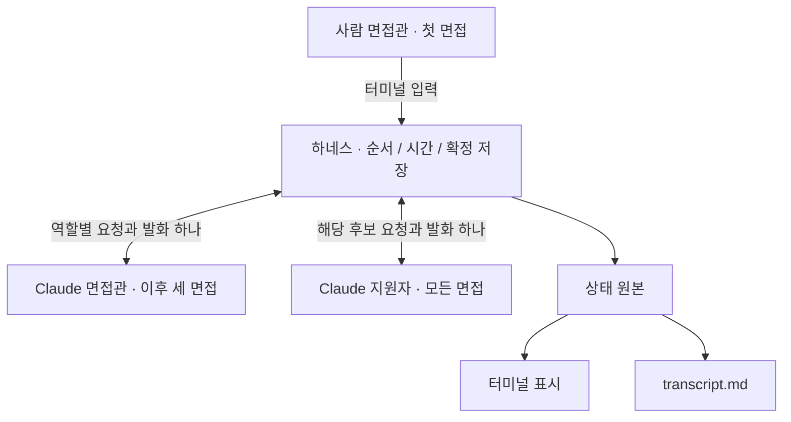

# 터미널 4명 면접 전환 스펙

작성일: 2026-09-17  
상태: 사용자와 합의한 구현 기준. 2026-09-18 터미널 전환 구현에 적용했다. 검증 범위는 [검증 기록](verification.md)에 구분한다.  
구현 순서: [구현 계획](terminal-interview-plan.md)

## 1. 목적과 확정 사항

카카오톡 연결과 운영 서버 연동을 제거한다. 사용자는 터미널에서 면접을 진행하고, 하네스는 대화를 실시간으로 표시하면서 후보별 문서에 저장한다. 면접 시작에 필요한 사용자 확인은 `insights.md`의 기준 확인이다. 설치와 Claude 로그인은 자동 점검하며, 준비되지 않았을 때만 안내한다.

첫 번째는 사람이 면접관을 맡고, 다음 세 명은 Claude가 면접관을 맡는다. 지원자는 네 면접 모두 Claude가 연기한다. 모든 후보는 기술면접을 통과한 인성 면접 대상이다. 회사와 직무는 기존 코어브릿지웍스 / 경영지원·사업운영 담당자를 유지한다.

| 항목 | 결정 |
| --- | --- |
| 대화 진행 | 한 하네스가 발언 차례·시간·저장을 관리한다. |
| 모델 실행 | 자기 차례에 별도 Claude CLI 호출로 다음 발화 하나를 만든다. |
| 맥락 유지 | 해당 역할의 설정과 해당 면접의 확정 대화 전체를 매 호출에 전달한다. |
| 기록 | 하네스만 상태와 원문을 기록한다. 에이전트가 문서를 감시하거나 수정하지 않는다. |
| 실시간 표시 | 완성된 발화를 즉시 표시하고, 대기 중에는 생성 상태와 남은 시간을 보여준다. |
| 자연스러운 후보 | 기존 인물 설정을 살리며, 답변의 정리 정도·구체성·길이가 상황에 따라 달라지게 한다. |
| 평가 | 매 면접 뒤 실제 사용자의 평가와 인사이트 변경 여부를 기다린다. |
| 완료 | 네 번째 피드백 이후 최종 순위를 로컬 파일로 저장한다. 외부 제출은 없다. |

역할별 상주 프로세스, 문서 감시 방식, 글자 단위 스트리밍은 첫 구현에 포함하지 않는다. 짧은 실제 모델 검사에서 호출 지연을 측정한 뒤 필요하면 별도 개선한다. 운영 서버는 사용하지 않지만 Claude 모델 호출에는 기존 본인 계정과 네트워크 연결이 필요하다.

## 2. 유지할 규칙과 제거할 기능

### 유지

- 첫 `init`에서 `harness/candidate_pools.json`으로 네 명을 배정한다. P07이 첫 번째이며 중상·중하·상에서 한 명씩 뽑고 뒤 세 순서를 섞는다. 재시작 때 다시 추첨하지 않는다.
- 후보군 ID와 분류를 모델이 새로 만들거나 바꾸지 않는다. 구간 정보는 지원자·면접관·최종 순위 모델 어느 쪽에도 전달하지 않는다.
- 첫 면접의 최대 시간은 1,800초, 이후는 각 1,200초다. 모델 생성과 오류 대기도 시간에 포함하며 중단·재시작으로 연장하지 않는다.
- 첫 발화는 `OOO님 면접 시작하겠습니다`, 마지막 발화는 `수고하셨습니다`다. 하네스가 정확한 문구를 기록한다.
- 처음 1~2분은 자기소개·기본 사항, 마지막 2분은 후보 질문·마지막 말에 사용한다.
- 기준 원본은 세션 폴더의 `insights.md`다. 면접에서는 시작 때 확정한 사본을 사용한다.
- 인사이트 수정은 사용자의 구체적인 지시 또는 직접 편집으로만 이루어진다. 자동 추출·자동 학습 역할을 추가하지 않는다.
- 매 후보의 사용자 평가와 인사이트 변경 여부가 확정돼야 다음 후보로 넘어간다.
- 최종 순위는 네 번째 피드백 뒤 최종 기준으로 네 명의 실제 원문과 사용자 평가를 비교한다. 인용 검증과 확정 사본 보존을 유지한다.

### 제거

카카오 설정·화면 관찰·발송 확인·컴퓨터 사용 권한·방 및 발신자 지정·관찰 ID 생성·불확실 전송 복구·카카오 전용 잠금을 제거한다. 카카오의 분 단위 시각 보정도 제거한다.

운영 서버 상태 확인·행사/이메일/코드/제출 토큰 입력·최종 HTTP 제출·접수 확인·제출 재시도를 제거한다. 새 세션에는 `operator-handoff.json`, `final-payload.json`, `receipt.json`, `computer-use/`를 만들지 않는다.

사용자가 OS를 선택하거나 설정 JSON을 작성하는 단계도 제거한다. 시작 파일은 OS를 자동 감지하고 의존성과 본인 Claude 인증을 확인한다. `init`과 `run`의 인증 검사도 유지한다.

## 3. 사용자 흐름과 터미널

### 시작

1. Mac의 `실행.command` 또는 Windows의 `실행.bat`를 실행한다. Claude Desktop과 Computer Use는 필요하지 않다.
2. 의존성·Claude 설치 및 인증·후보 자료를 자동 검사한다. 정상인 항목은 입력을 요구하지 않는다. 기본 모델은 기존 `sonnet`으로 두며 개발자 옵션으로만 변경할 수 있다.
3. 새 세션이면 한 번 배정하고 `insights.md`를 준비한다. 기존 세션이면 저장된 배정과 진행 상태를 읽는다.
4. 각 면접 시작 전 현재 인사이트 경로와 내용을 확인할 수 있게 보여준다. 사용자가 `시작`을 입력하면 비어 있지 않은 기준인지 검사하고 확인한 내용의 해시와 시각을 저장한다.
5. 확인한 내용과 시작 직전 내용이 다르면 바뀐 기준을 다시 확인한다. 재개 중인 면접은 기존 기준 사본과 마감 시각을 사용한다.
6. 후보별 `transcript.md`를 만들고 시작 발화와 자기소개 요청을 기록한다. 시작 선언 자체에는 별도 후보 응답을 생성하지 않고 자기소개 요청 뒤 후보 차례를 연다.

`insights.md`가 템플릿 상태이거나 필수인 `중요하게 보는 기준`이 비어 있으면 시작하지 않는다. 면접 도중 기준이 바뀌어도 이번 면접의 모델 입력은 바꾸지 않는다.

### 표시와 입력

```text
1/4 · 오시온 · 사람 면접 · 남은 시간 29:42
기록: …/01-P07/transcript.md

면접관: 오시온님 면접 시작하겠습니다
면접관: 먼저 간단한 자기소개를 부탁드립니다.

[지원자 답변 생성 중…]
지원자(오시온): …

면접관 >
```

질문은 접두어 없이 입력하고 Enter로 확정한다. 기존 `q 질문내용`도 별칭으로 받을 수 있다. 표시 이름은 `면접관`과 `지원자(이름)`으로 통일한다. AI 면접에서도 실제 확정된 발화를 순서대로 보여주며, 생성 중에는 어느 역할을 기다리는지 표시한다.

| 입력 | 동작 |
| --- | --- |
| 일반 텍스트 / `q 질문내용` | 첫 면접에서 사용자의 발화를 저장한다. 지원자의 질문에 대한 사람의 답도 같은 방식이다. |
| `/last` | 사람 면접에서 마무리를 요청한다. |
| `/end` | 사람 면접의 마무리 발화에 대한 후보 응답을 받은 뒤 종료한다. |
| `/status` | 현재 후보, 단계, 남은 시간, 대기 중인 역할과 문서 경로를 표시한다. |
| `/retry` | 실패하거나 중단된 현재 차례를 다시 요청한다. 이미 확정된 발화는 반복하지 않는다. |
| Ctrl+C | 프로세스를 정리하고 중단한다. 마감 시각은 유지된다. |

지원자 응답 대기 중 입력한 새 발화는 자동 대기열에 쌓거나 전송하지 않는다. 아직 접수되지 않았음을 알리고, 작성하던 문장은 가능하면 입력란에 보존한다. 명령은 발화로 기록하지 않는다. AI 면접에서는 일반 텍스트 입력을 면접관 발화로 받지 않는다.

시간 표시와 모델 결과 출력은 사람이 작성 중인 입력을 깨뜨리지 않아야 한다. 한국어 입력, 붙여넣기, 창 크기 변경은 Mac·Windows에서 확인한다. 생성 대기는 가짜 발화나 인위적인 타이핑 지연으로 채우지 않는다.

### 면접 이후

기존처럼 `feedback.md`를 열고 `종합 평가`, `근거`, `우려·확인할 점`을 사용자가 작성한다. 우려가 없으면 `없음`을 쓸 수 있다. 인사이트 `수정` 또는 `그대로` 선택을 실제 파일 변경과 대조한 뒤 평가와 전후 기준 사본을 확정한다. 다음 후보 시작 전에는 다시 사용자 입력을 기다린다.

네 번째 평가 확정 뒤 순위를 생성하고 `ranking.md`와 구조화된 `ranking.json`을 로컬에 저장한다. 네 번째 `insights.after.md`와 해시가 같은 기준을 사용한다. 이후 현재 `insights.md`가 바뀌어도 이미 확정한 결과를 몰래 다시 만들지 않는다. `finalize` 재실행은 저장된 결과를 확인하며, 결과가 확정됐다면 모델을 다시 호출하지 않는다.

## 4. 하네스와 모델 실행



한 세션에는 상태를 쓰는 하네스가 하나만 존재한다. 잠금 획득에 실패한 두 번째 실행은 진행하지 않는다. 한 면접에서 활성 모델 작업도 최대 하나이며, 면접관과 지원자의 발화를 동시에 생성하지 않는다.

모델 호출은 역할별 프롬프트와 입력을 가진 독립적인 CLI 실행이다. 지원자 역할의 기억이 면접관 역할이나 다음 후보에게 이어지지 않는다. 파일·검색·화면 도구, MCP, 훅, 프로젝트 설정을 통한 추가 입력은 기존 실행기처럼 비활성화한다. 모델은 파일 경로를 받아 직접 읽지 않고 하네스가 구성한 자료만 받는다.

세션에 사용한 자료와 프롬프트의 버전·해시를 고정한다. 재개 시 다른 버전이 발견되면 기존 버전을 복원하거나 새 세션을 시작하도록 안내하며, 진행 중인 후보의 설정을 자동 교체하지 않는다.

호출은 타이머 및 입력 처리를 막지 않는 작업으로 실행한다. 실행기는 실제 자식 프로세스의 종료를 제어할 수 있어야 한다. Future의 취소 표시만으로 모델 실행이 중지됐다고 처리하지 않는다. 타임아웃·Ctrl+C·종료 때 Mac·Windows 모두 생성 프로세스를 정리하고, 이미 종료된 면접에 늦게 도착한 결과는 버린다.

### 차례 처리

```text
시작 → 자기소개 요청 → 지원자 생성
  → 사람 입력 대기 또는 AI 면접관 생성
  → 지원자 생성 → 반복
  → 마무리 → 종료 → 사용자 평가 대기
```

각 요청에는 `turn_id`, 직전 확정 발화 ID, 역할, 대화/입력 해시, 단계, 허용 마감 시각을 저장한다. 실행 시도 번호는 재시도마다 구분한다. 정상 결과라도 후보·차례·직전 발화·단계가 현재 상태와 일치해야 채택한다.

모델 결과는 `{"text": "이번 발화"}` 형식이다. 지원자는 최대 1,800자, 면접관은 기존 최대 1,500자를 유지하며 추가 필드와 빈 본문은 거부한다. 화자·ID·시각·순서는 하네스가 붙인다. 내부 설명, 상대방 대사, 시작·종료 제어 발화를 모델이 대신 작성하지 않도록 프롬프트와 검사를 둔다. 사실성·자연스러움은 형식 검사만으로 보장됐다고 보고하지 않는다.

질문과 답변은 반드시 한 쌍의 문답 형태일 필요는 없다. 후보가 범위를 되묻거나 회사에 질문하면 다음 면접관 차례에서 답하고, 정정된 사실은 이후 맥락에 반영한다. 면접관이 모르는 회사 정책은 지어내지 않는다.

## 5. 후보 자료와 역할별 입력

### 참고 원본과 가져올 범위

개발 참고 원본은 `~/Downloads/hr-training-runtime 2`다. 이 폴더는 읽기 전용으로 참조한다. 완성된 실행본이 해당 경로나 기존 서버에 의존하지 않도록 필요한 자료는 구현 때 검토하여 로컬 실행 패키지에 포함한다.

원본의 `web-server/models/worlds/corebridge-personality/candidates/<ID>/ground_truth/`에는 아래 자료가 있다. 2026-09-17에 확정 후보군 8명 전체의 파일 존재와 JSON 필드 구조를 확인했다. 후보별 원문 전체의 의미 검토와 가져오기는 구현 단계에 남아 있다.

| 원본 | 지원자 입력으로 사용할 내용 |
| --- | --- |
| `history.json` | `temporal_scope=past_or_current_at_interview`인 사건의 사실. 사건 순서와 기존 수치·담당 범위를 보존한다. |
| `motivations.md` | 현재 일을 선택하는 이유와 관심. 장래 희망은 현재의 의향으로만 유지한다. |
| `behavior_patterns.md`, `traits.md` | 과거·현재 경험에 근거한 경향과 한계. 평가 구간이나 미래 결과로 바꾸지 않는다. |
| `self_expression.json` | `voice`, `self_expression`, `memory_rule`, `pressure_rule`, `unknowns`, `evidence_status`. |
| `current_state.json` | 아래 9개 현재 상태의 `state`와 불확실성만 추려 사용한다. |
| 현재 프로젝트의 공개 지원 자료 | 본인이 제출한 이력서와 지원동기. |

현재 상태의 9개 항목은 `current_career_goal`, `push_factors`, `pull_factors`, `priority_hierarchy`, `role_expectation`, `autonomy_manager_expectation`, `decision_context`, `non_negotiables_tolerance`, `major_current_uncertainties`다.

`current_state` 원본에는 `evidence_refs`, `evidence_type`, `confidence`, `future_relevance`가 함께 있다. 원본 객체를 그대로 넘기지 않는다. `evidence_type`의 DIRECT/INFERRED/UNKNOWN은 각각 stated/tentative/unknown으로 매핑해 현재 생각의 확실성만 보존하고, 나머지 내부 메타데이터는 제외한다. UNKNOWN 내용을 확정된 자기 생각으로 바꾸지 않는다. 출처 ID와 해시는 자료 검증용 별도 목록에 두고 발화 입력에 섞지 않는다.

이번에 가져올 후보 전용 자료는 확정 후보군인 P01·P02·P03·P04·P06·P07·P08·P10의 8명분이다. 선택된 네 명만 가져오지 않으며, 파일이 빠졌다고 추첨 후보군을 줄이지 않는다. 공개 지원 자료 10명은 기존대로 보관할 수 있다.

현재 원본의 `AuthoredWorld` 로더는 후보 설정을 만드는 과정에서 미래 trajectory와 결과 검증 자료도 읽는다. 이를 통째로 이식하지 않고, 허용 파일과 필드만 읽는 전용 추출기를 만든다. `interactions/`, 미래 시나리오·근속 수치·HCF·평가 정답·운영 상태·자격 증명은 가져오지 않는다. 확정 후보군을 원본 서버의 회차 배정으로 대체하지 않는다.

### 입력 경계

| 역할 | 허용 입력 | 제외할 입력 |
| --- | --- | --- |
| 지원자 | 본인 persona, 공개 회사 자료, 현재 면접 상황, 해당 면접의 확정 대화, 마무리 단계 | 인사이트, 사용자 평가, 순위, 구간, 다른 후보 설정, 회사 비공개 현실, 미래 결과 |
| 면접관 | 공개 회사 자료, 해당 후보의 공개 지원 자료, 시작 시 인사이트 사본, 해당 면접 대화, 단계·남은 시간 | 후보 persona 원문, 구간, 다른 후보의 비공개 설정, 미래 결과 |
| 최종 순위 | 최종 기준, 공개 회사 자료, 네 명의 확정 원문과 사용자 평가, 당시 기준·시간·진행 예외 | persona, 구간, 평가 정답, 미래 결과 |

입력 객체는 역할별 허용 목록으로 새로 구성한다. 공용 세션 객체 전체를 전달한 뒤 프롬프트로 일부를 무시하게 만들지 않는다. 구간 정보는 배정 코드에만 남고 후보 자료 가져오기 목록에도 구간 라벨을 덧붙이지 않는다.

로컬 후보 자료 분리는 모델에 제공하는 입력의 경계다. 같은 컴퓨터의 파일을 사용자로부터 숨기는 별도 보안 시스템을 뜻하지 않는다. 후보 설정 원문을 일반 면접 화면·평가 문서·최종 결과에 출력하지 않는다.

## 6. 사람처럼 응답하는 후보 프롬프트

### 목표와 우선순위

후보는 자신의 경험을 가진 사람으로서 그때 받은 말에 답한다. 면접 코치가 만들어 준 모범 답안처럼 매번 완결된 설명을 하지 않는다. 다만 능숙하고 또렷하게 말하는 후보의 기존 설정도 그대로 살린다.

우선순위는 사실과 기억의 범위 → 해당 후보의 성향·말투 → 직전 질문과 대화 맥락 → 표현의 자연스러움이다. 자연스러움을 위해 사실이나 후보의 능력을 바꾸지 않는다. 직무와 무관한 인구학적 특성으로 말투나 부족함을 정하지 않는다.

### 추가할 행동 기준

| 상황 | 기대하는 반응 | 과하게 만들지 않을 부분 |
| --- | --- | --- |
| 넓은 질문 | 먼저 자기 방식으로 요점이나 느낌을 말할 수 있다. 사례와 근거가 처음부터 다 나오지 않아도 된다. | 모든 첫 답변을 추상적으로 만들거나 아는 사실을 일부러 숨기지 않는다. |
| 구체적인 후속 질문 | 실제 설정에 있는 본인의 행동·담당 범위·시점을 설명한다. | 이미 받은 구체적 질문에도 두루뭉술한 답만 반복하지 않는다. |
| 이유를 묻는 질문 | 정리되지 않은 선호나 당시 판단을 일상적인 말로 설명할 수 있다. | 매번 역량명·성찰·개선 계획으로 결론짓지 않는다. |
| 기억이나 경험이 부족함 | 모르는 범위를 인정하고 알고 있는 부분만 말한다. | 날짜·수치·동료·새 사건을 만들거나, 설정상 아는 것을 무작위로 잊지 않는다. |
| 잘못된 전제·반박 | 후보 성향에 맞게 바로잡거나 배경을 설명한다. 자신이 틀렸다면 정정한다. | 무조건 동의하거나 일부러 모순·방어·자기비난을 만들지 않는다. |
| 불완전한 경험 | 기존의 미숙함·늦은 판단·설명하기 어려운 부분을 남긴다. | 없던 결함을 추가하거나 모든 약점을 성공담으로 바꾸지 않는다. |
| 반복 질문·압박 | 이전 발언을 기억하고 필요한 부분만 보충한다. | 같은 사례를 처음 듣는 것처럼 반복하거나 압박마다 같은 말버릇을 넣지 않는다. |

존댓말을 기본으로 후보별 말투를 따른다. 짧은 답과 설명이 필요한 답의 길이를 달리한다. 대체로 한두 문단 안에서 상대의 차례를 남기되 문장 수를 강제하지 않는다. 질문이 요구하지 않은 STAR 형식, 번호 목록, 보고서 제목, 전문 용어, 교훈으로 매 답을 채우지 않는다.

`음`, `그러니까`, 말 고침은 맥락에 맞을 때 가끔 쓸 수 있다. 정해진 비율로 삽입하거나 모든 답의 첫머리에 붙이지 않는다. 일부러 오타·비문·말줄임표·웃음·무대 지문을 넣지 않는다. 자연스러움은 별도 윤문 에이전트나 후처리 모델 없이 후보 프롬프트 안에서 구현한다.

### 후보 프롬프트 추가 문안

아래는 기존 candidate-actor 프롬프트에 합칠 구현 초안이다. 기존의 사실 보존·현재 상태·마무리 단계 지시를 유지한 채 중복을 정리한다.

> 지금은 실제 면접에서 질문을 듣고 답하는 상황이다. 준비된 모범 답안을 제출하려고 하지 말고, 이 사람이 알고 겪은 범위에서 상대에게 말한다.
>
> 질문이 넓으면 본인이 먼저 떠올리는 요점이나 느낌부터 말해도 된다. 이유와 사례를 한 번에 전부 정리할 필요는 없다. 상대가 구체적으로 물으면 설정에 있는 경험으로 더 자세히 설명한다. 이미 구체적인 질문을 받았다면 일부러 흐리게 답하지 않는다.
>
> 모든 경험에 명확한 교훈이나 개선 계획이 있는 것은 아니다. 이 인물에게 남아 있는 미숙함, 설명하기 어려운 이유, 아직 정하지 못한 생각은 그대로 둔다. 없는 약점을 만들어 내거나 기존 약점을 지우지 않는다.
>
> persona의 말투와 기억 규칙을 따른다. 능숙한 인물은 능숙하게 말해도 되고, 짧게 말하는 인물은 필요한 만큼만 답해도 된다. 모든 후보를 똑같이 머뭇거리거나 어눌하게 만들지 않는다. 자연스러움을 위해 아는 사실을 틀리게 말하지 않는다.
>
> 대화에 맞는 존댓말을 쓴다. 매번 상황·행동·성과·배운 점을 모두 나열하지 않는다. 군말이나 말 고침은 필요한 때만 쓰고, 제목·평가 항목·내부 메모·상대방의 다음 대사는 쓰지 않는다. 이번에 상대에게 할 말 하나만 반환한다.

### 표현 예시의 사용법

아래는 특정 후보의 사실을 묘사하지 않는 합성 예시다. 운영 후보의 이력이나 모델의 사실 입력으로 추가하지 않는다. 사실 조건이 맞을 때의 표현 차이만 검토한다.

| 조건 | 피할 답변 | 가능한 답변 |
| --- | --- | --- |
| 범위를 먼저 정리하는 경험이 실제 설정에 있음 | “우선순위 관리와 이해관계자 정렬을 통해 업무 효율성을 극대화했습니다.” | “일이 같이 들어오면 좀 헷갈려서요. 일단 오늘까지 해야 하는 것부터 나눠 봤어요.” |
| 본인이 한 것은 목록 정리뿐임 | “전체 프로세스를 주도해서 문제를 해결했습니다.” | “제가 한 건 빠진 목록을 정리하는 데까지였어요. 수정은 담당자가 했고요.” |
| 정확한 수치가 설정에 없음 | “약 30% 개선했습니다.” | “정확히 얼마나 줄었는지는 말씀드리기 어려워요.” |

면접관도 한 번에 한 가지를 담백하게 묻고, 후보 답변을 매번 요약·칭찬·평가하지 않는다. 추상적인 답에는 필요한 범위에서 후속 질문을 하되 말이 짧거나 매끄럽지 않다는 이유만으로 낮게 평가하지 않는다. 최종 순위 모델도 말투·유창함·문장 길이를 역량의 대리 지표로 쓰지 않는다.

## 7. 시간, 마무리와 실패 처리

첫 시작 발화를 상태에 확정한 로컬 시각을 `started_at`으로 저장하고 마감을 한 번 계산한다. UTC 시각을 저장하고 터미널에서는 남은 시간을 표시한다. 실행 중 경과 시간에는 단조 시계를 사용하고, 재시작에는 저장한 절대 마감을 적용한다. 시계가 뒤로 크게 바뀐 것이 감지되면 조용히 시간을 늘리지 않고 복구 확인 상태로 전환한다.

마감은 사람 30분·AI 20분이며 28분·18분에 마무리를 준비한다. 그때부터 새 본 질문을 생성하지 않는다. 진행 중인 일반 면접관 생성은 취소한다. 직전 질문에 대한 지원자 답변이 생성 중이면 마감 내에서 그 답변을 먼저 받고 마무리 안내를 보낸다. 오류로 끝난 경우 실패를 표시하고 마무리로 넘어가며 답변을 만들어 채우지 않는다.

이때는 마무리 요청을 대기 표시로 저장하고, 진행 중인 지원자 차례의 단계를 응답 처리까지 유지한다. 경계 시각을 넘었다는 이유만으로 허용된 후보 답변을 오래된 단계의 결과로 버리지 않는다. 실제 마감과 종료가 발생하면 이 예외 없이 결과를 폐기한다.

마무리에서는 기존의 질문/마지막 말 안내를 사용하고, 후보 질문 → 면접관 답변 → 후보 마지막 말 → 종료 흐름을 관리한다. 후보 질문이 없다면 마지막 말로 넘어갈 수 있다. 현재 단계는 지원자 입력의 `closing_stage`에 전달한다. 마감 직전에는 모든 단계를 억지로 완료하지 않고 종료를 우선한다. 첫 면접에서 사용자가 더 일찍 마무리를 요청하는 기존 기능도 유지한다.

마감에 도달하면 활성 생성을 취소하고 `수고하셨습니다`를 한 번 기록한다. 종료 뒤에는 후보의 예의상 답변도 생성하지 않는다. 답변이 마감 전에 생성됐더라도 마감 전에 상태에 확정되지 않았다면 면접 원문에 넣지 않는다. 문장 일부를 잘라 정상 답변으로 채택하지 않는다.

컴퓨터가 꺼졌거나 하네스가 중단된 동안 자동 종료를 보장하지 않는다. 재개 시 마감이 지났다면 미완료 차례를 폐기하고 종료를 먼저 기록한다. 실제 종료 기록 시각과 마감의 차이를 `protocol_note`에 남긴다. 생성 오류·사용량 제한·인증 만료는 역할과 재시도 가능 여부를 알려주고 타이머는 계속 진행한다. 원시 stderr나 인증 자료는 표시하지 않는다.

## 8. 저장과 재시작

새 세션 버전은 `founder-terminal-1`로 구분한다. 기존 저장 구조를 활용해 `state.json`을 확정 대화와 진행의 단일 원본으로 둔다. 대화 규모가 작은 네 명 세션이므로 별도 서버·DB·문서 감시 서비스는 추가하지 않는다.

| 파일 | 내용과 쓰기 주체 |
| --- | --- |
| `insights.md` | 사용자 기준 원본. 사용자가 편집하거나 명시한 수정만 반영한다. |
| `state.json` | 배정·시각·확정 발화·현재 차례·사용자 확인·확정 평가. 하네스 명령만 쓴다. |
| `01-P07/` ~ `04-…/transcript.md` | 확정 대화에서 생성하는 읽기용 원문. 하네스만 쓴다. |
| 각 후보 `feedback.md` | 실제 사용자 평가 입력. |
| 각 후보 `feedback.confirmed.md` | 확정 사용자 평가. |
| 각 후보 `insights.before.md`, `insights.after.md` | 면접 시작 및 평가 확정 때 기준 사본. |
| `ranking.md`, `ranking.json` | 최종 기준 해시·근거·불확실성을 포함한 로컬 결과. |

발화 ID는 순서가 있는 `local-message-*`로 생성하며 로컬 기록 ID라고 부른다. 일반 발화뿐 아니라 시작·마무리·종료에도 중복 방지 키를 둔다. 역할 구분과 사람이 작성했는지 여부는 별도 필드로 보존한다.

요청을 저장한 뒤 모델을 실행하고, 결과 검사를 통과하면 발화 추가와 차례 완료를 같은 원자적 상태 저장으로 확정한다. 그 뒤 문서와 터미널을 갱신한다. 모델 실행 횟수가 정확히 한 번임을 보장하는 대신, 같은 차례의 확정 발화가 한 번만 저장되도록 한다.

상태 저장 뒤 문서 갱신 전에 중단되면 저장된 원문으로 문서를 재생성한다. 재개 시 기존 대화를 보여줄 수 있지만 새 발화처럼 중복 추가하지 않는다. 상태에 결과가 확정되지 않은 요청은 중단 상태로 표시하고, 마감 전이면 `/retry`로 같은 차례를 새 시도로 실행할 수 있다. 완료된 차례는 다시 생성하지 않는다.

최종 순위도 검증된 결과와 완료 상태를 함께 확정한 뒤 `ranking.md`와 `ranking.json`을 만든다. 결과 파일 중 하나를 쓰기 전에 중단돼도 저장된 순위에서 복구하며 모델을 다시 호출하지 않는다.

문서가 단순히 갱신되지 않은 경우와 외부에서 변경된 경우를 마지막 생성본 해시·상태 버전으로 구분한다. 원문 외부 수정·잘림·손상을 발견하면 자동 덮어쓰기나 진행을 멈추고 확인한다. 사용자가 복구를 선택할 때만 확정 상태에서 문서를 다시 만든다. 기준 사본·확정 평가·순위 결과도 해시를 확인한다. 사람이 JSON을 직접 편집해 단계를 넘기지 않는다.

## 9. 기존 세션과 문서 전환

기존 `founder-light-1` 세션을 터미널 세션으로 자동 변환하지 않는다. 화면 전송이 불확실한 기록을 새 로컬 발화로 취급하지 않는다. 파일은 보존하고, 새 실행본에서는 기존 세션임을 알린 뒤 새 세션 경로를 사용하도록 안내한다. 기존 결과의 별도 조회·명시적 마이그레이션은 이번 범위 밖이다.

구현 때 새 기본 경로는 `.runtime/terminal-light`로 바꿔 기존 `.runtime/light`와 충돌하지 않게 한다. 새 시작 명령은 설정 파일 없이 동작한다. README·setup·시작 파일·`AGENTS.md`·`CLAUDE.md`를 같은 전환에서 갱신하고, 구 운영 API/Computer Use 안내는 기존 방식의 보관 문서로 분리한다.

현재의 비공개 후보 자료 반입 제한은 사용자 합의에 따라 지원자 역할에 필요한 과거·현재 설정만 허용하는 규칙으로 변경한다. 미래 결과·운영 상태·자격 증명 반입 금지는 유지한다. 문서 작성 단계에서는 실행 규칙과 코드를 먼저 바꾸지 않는다.

## 10. 완료 기준

| ID | 확인할 결과 |
| --- | --- |
| A01 | 정상 설치·로그인 환경에서 서버/카카오/OS 설정 질문 없이 기준 확인 후 시작한다. 인증·자료 누락은 시작 전에 안내한다. |
| A02 | 기존 확정 후보군으로 한 번만 추첨하고 P07 첫 번째와 재시작 시 배정을 유지한다. |
| A03 | 첫 면접에서는 실제 사람 입력에 후보가 답하고, 다음 세 면접은 역할을 나눠 자동으로 대화한다. |
| A04 | 발화가 완성될 때마다 터미널과 문서에 반영된다. 한국어 입력과 대기 상태 표시가 충돌하지 않는다. |
| A05 | 이중 실행·재시도·중단·복구에서 확정 발화가 중복되거나 다른 후보에게 섞이지 않는다. |
| A06 | 1,800/1,200초 마감과 마무리 우선 처리를 지키며, 지연된 결과와 종료 뒤 발화가 원문에 들어가지 않는다. |
| A07 | 지원자에게 기준·평가·구간이, 면접관/순위 모델에게 persona·미래 결과가 전달되지 않는다. |
| A08 | 실제 사용자 평가와 인사이트 선택 없이는 다음 후보·최종 완료로 넘어가지 않는다. |
| A09 | 최종 기준으로 네 명의 고유한 순위를 저장하고 인용·해시를 검증한다. 어떤 운영 서버 요청도 하지 않는다. |
| A10 | 기존 세션을 덮어쓰지 않으며, 원문 변조와 단순 갱신 지연을 구분한다. |
| A11 | 실제 Claude 대화에서 후보별 말투와 사실을 유지한다. 넓은 질문·후속 질문·모르는 내용·정정·압박에 과장 없이 반응한다. |
| A12 | Mac·Windows 결과를 따로 기록한다. 합성 테스트 통과를 실제 모델 또는 사용자 네 명 실습 완료라고 보고하지 않는다. |

현재 문서 작성에서는 소스·자료 구조만 확인했다. 자료 반입, 새 프롬프트 적용, 실제 모델 대화와 터미널 전환 검증은 수행하지 않았다.

## 11. 확인한 참고 자료

| 위치 | 설계에 반영한 내용 |
| --- | --- |
| 현재 `harness/interview.py`, `harness/__main__.py` | 타이머와 모델 작업 분리, 터미널 입력·출력, 사람 평가 대기 흐름 |
| 현재 `harness/storage.py`, `harness/finalize.py` | 원자적 저장·잠금·사본·해시·순위 근거 검증 |
| 현재 `harness/provider.py`, `harness/auth.py` | 역할별 Claude 호출, 도구 제한, 본인 로그인 확인 |
| 원본 `web-server/agents/candidate-actor/contract.md`, `prompt.md`, `profiles/personality/prompt.md` | 후보가 실제 들은 말에 다음 발화 하나를 생성하는 계약 |
| 원본 `web-server/agents/candidate-actor/input-view.json`, `output-schema.json`, `checks.md` | 입력 허용 목록, 출력 형식, 형식 검사와 실제 대화 품질 검사의 구분 |
| 원본 `web-server/src/hr_server/engine.py`의 `_accept_question` | 질문 접수 뒤 후보 자료와 대화를 구성해 호출하는 흐름 |
| 원본 `web-server/src/hr_server/authored.py` | 후보 자료 구성과 현재 상태 구조. 전체 로더를 가져오면 미래 자료까지 읽는 의존성 확인 |
| 원본의 확정 후보군 8명 `ground_truth/` | 필수 파일 존재·시간 범위·현재 상태 필드 확인. P07·P03·P06 말투 설정 원문 확인 |

이 문서에는 실제 후보의 비공개 사건이나 예상 평가를 예시로 복사하지 않았다.
